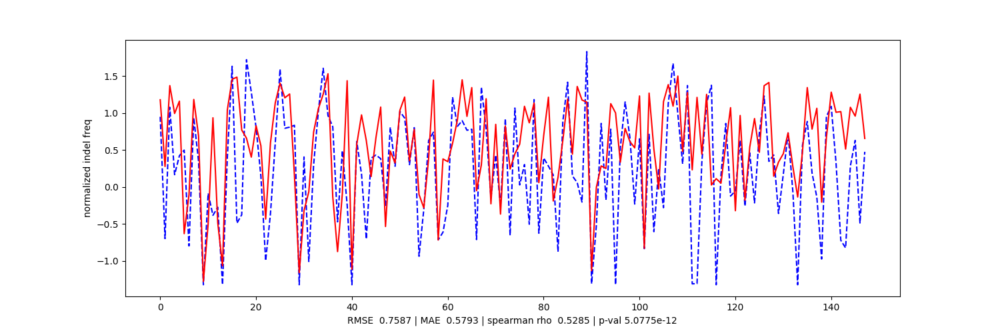

a residual cnn/ multitask learning (MTL) cnn / cnn + xgboost ensemble for prediction of crispr-cas12a indel frequency
 
<!-- inputs are z-score normalized - typically reaches ~0.40 RMSE / ~0.30 MAE on random data and ~0.6 RMSE during training (see graphs)
 
 -->
